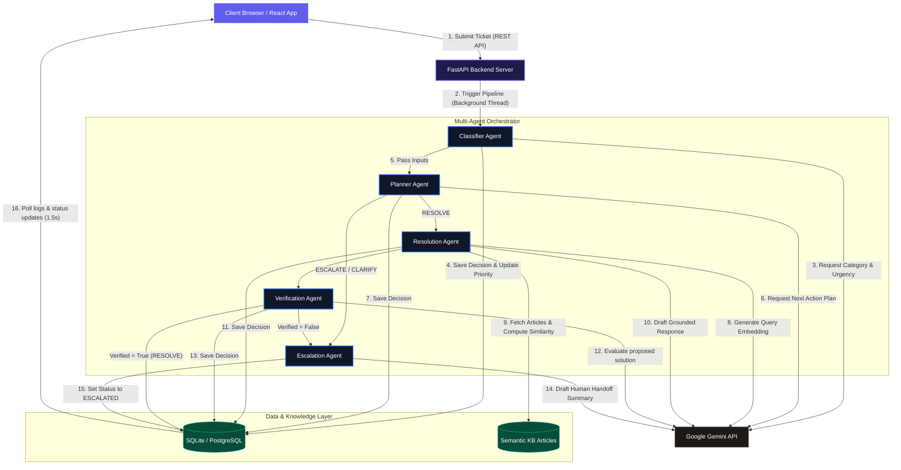

# Antigravity: Agentic AI Helpdesk Platform
### Autonomous Ticket Resolution with Multi-Agent Decision Chains & Semantic Retrieval

Antigravity is an agentic AI-powered customer support platform. Rather than relying on a single, generic chatbot, Antigravity decomposes the support workflow into a sequence of specialized, schema-enforced AI agents. Each agent operates with a clearly defined role, decision boundary, and state validation rule, enabling predictable automation, transparency, and a clean observability audit trail.

---

## 🏗️ System Architecture & Data Flow

Below is the end-to-end architecture showing how tickets are processed from intake through classification, planning, semantic retrieval, verification, and resolution or escalation.



---

## 🌟 Key Concepts & Demonstrations

This project is built to demonstrate the following agentic design patterns and software engineering best practices:

### 1. Multi-Agent System (ADK & Orchestration)
* **Code Location**: [backend/app/agents/](file:///c:/Users/Dhruv/Desktop/coding/Project_Development/agentic-helpdesk/backend/app/agents/)
* **Implementation**: We break down ticket management into a coordinated pipeline. The [orchestrator.py](file:///c:/Users/Dhruv/Desktop/coding/Project_Development/agentic-helpdesk/backend/app/agents/orchestrator.py) manages state transitions and executes:
  1. **Classifier**: Categorizes the ticket and assesses urgency.
  2. **Planner**: Decides the strategy (`RESOLVE`, `CLARIFY`, `ESCALATE`).
  3. **Resolution**: Semantically retrieves KB articles to draft a grounded response.
  4. **Verification**: Critically validates the solution for correctness and safety.
  5. **Escalation**: Handles failures or safety limits by writing a summary for human operators.

### 2. Model Context Protocol (MCP) Server
* **Code Location**: [backend/app/mcp_server.py](file:///c:/Users/Dhruv/Desktop/coding/Project_Development/agentic-helpdesk/backend/app/mcp_server.py)
* **Implementation**: We implemented a fully operational **MCP Server** using the Python MCP SDK. It exposes tools to external LLM clients (such as Claude Desktop, Cursor, or standard LLM gateways) to read tickets, query the database, search the semantic knowledge base, and trigger resolution workflows.

### 3. Safety & Security Features
* **Schema Enforcement**: In [gemini_client.py](file:///c:/Users/Dhruv/Desktop/coding/Project_Development/agentic-helpdesk/backend/app/agents/gemini_client.py), we enforce strict Pydantic schemas using Gemini's `response_mime_type="application/json"` to ensure LLM outputs always match our application models.
* **XSS Prevention**: The React frontend uses a customized safe-markup parser in [App.tsx](file:///c:/Users/Dhruv/Desktop/coding/Project_Development/agentic-helpdesk/src/App.tsx) that escapes all HTML tags in user ticket descriptions and LLM solutions before applying basic bolding and list tags, preventing Cross-Site Scripting (XSS).
* **Graceful Failure Isolation**: The orchestrator wraps execution in a try-except layer; if any agent fails (e.g. rate limit, invalid outputs), the ticket is automatically and safely escalated to a human agent, preventing system locks.

### 4. Production Deployability
* **Code Location**: [Dockerfile](file:///c:/Users/Dhruv/Desktop/coding/Project_Development/agentic-helpdesk/backend/Dockerfile) & [prod_requirements.txt](file:///c:/Users/Dhruv/Desktop/coding/Project_Development/agentic-helpdesk/backend/prod_requirements.txt)
* **Implementation**: We separated production dependencies into `prod_requirements.txt` to exclude heavy local ML libraries (like PyTorch/TensorFlow). This makes the Docker image lightweight and fully compatible with free-tier container builders (like Render or Railway) that have strict RAM and build timeout limits.

---

## 🛠️ Local Installation & Setup

### Prerequisites
* Python 3.11+
* Node.js (v18+)
* Google Gemini API Key

### 1. Backend Setup
1. Navigate to the backend folder:
   ```bash
   cd backend
   ```
2. Create and activate a virtual environment:
   ```bash
   python -m venv venv
   # On Windows:
   .\venv\Scripts\activate
   # On macOS/Linux:
   source venv/bin/activate
   ```
3. Install the dependencies:
   ```bash
   pip install -r prod_requirements.txt
   ```
4. Create a `.env` file in the `/backend` directory:
   ```env
   DATABASE_URL=sqlite:///./agentic_helpdesk.db
   GEMINI_API_KEY=your_gemini_api_key_here
   DEBUG=true
   ```
5. Start the FastAPI server:
   ```bash
   uvicorn app.main:app --reload
   ```
   The backend will be running at `http://localhost:8000`.

### 2. Frontend Setup
1. Navigate to the project root directory:
   ```bash
   cd ..
   ```
2. Install Node packages:
   ```bash
   npm install
   ```
3. Start the Vite React development server:
   ```bash
   npm run dev
   ```
   The frontend will be running at `http://localhost:5173`.

### 3. Running the MCP Server
To expose the Helpdesk tools to an external LLM client (like Claude Desktop or Cursor) via stdio transport:
1. Navigate to the backend directory:
   ```bash
   cd backend
   ```
2. Run the MCP server file directly using the virtual environment python:
   ```bash
   .\.venv\Scripts\python.exe app/mcp_server.py
   ```
   The server will start and wait for standard input/output JSON-RPC commands.

---

## 🚀 Production Cloud Deployment (Free Tier)

### 1. Database (Neon or Supabase)
1. Sign up on **Supabase** or **Neon** and provision a free PostgreSQL instance.
2. In Supabase, retrieve the **Connection Pooler** connection string (select **URI** and toggle **Pooler** mode on port `6543`).
   * *Note: Render's free tier does not support IPv6. Using the Supabase connection pooler is required as it resolves to an IPv4 host, preventing `Network is unreachable` errors.*

### 2. Backend Hosting (Render)
1. Create a free account on **Render** and link your GitHub repository.
2. Select **New Web Service**:
   * **Root Directory**: `backend`
   * **Runtime**: `Docker`
3. Add the following **Environment Variables**:
   * `DATABASE_URL`: *Your Supabase pooler connection string from Step 1.*
   * `GEMINI_API_KEY`: *Your Google Gemini API Key.*
   * `DEBUG`: `false`
4. Click **Deploy**. Render will host the backend container.

### 3. Frontend Hosting (Vercel)
1. Create a free account on **Vercel** and import your repository.
2. Vercel will auto-detect Vite. Set the following environment variable:
   * `VITE_API_URL`: *Your Render backend URL (e.g. `https://agentic-helpdesk-backend.onrender.com`).*
3. Click **Deploy**. Vercel will build the frontend and serve it at a public `.vercel.app` domain.